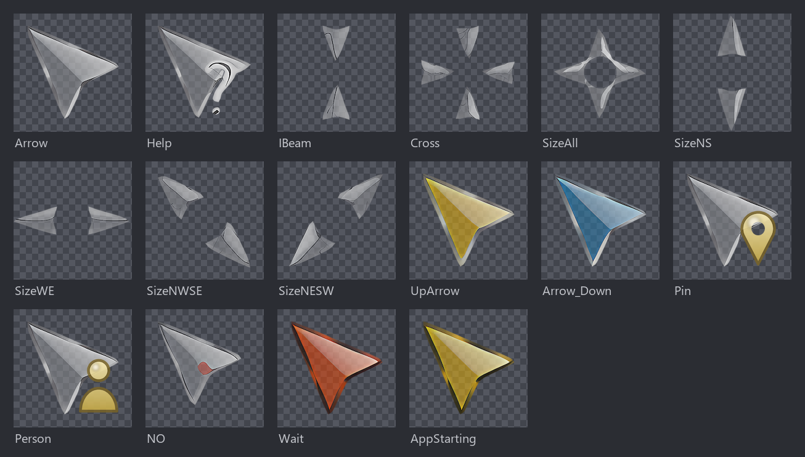
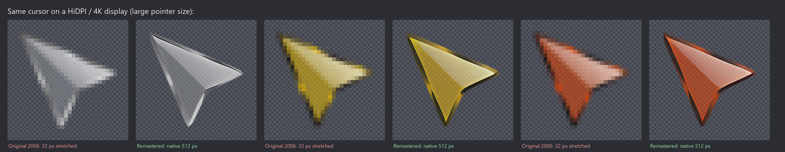

<div align="center">

# Chrome Glass Remastered

**Remember the glass cursors from 2006? They're back - and now they're crisp even on a 4K display.**

[](README.ru.md)
[](../../releases/latest)
[](#-windows-10--11)
[](#-linux)
[](#-macos)
[](LICENSE)



</div>

In 2006 a cursor set called "Chrome Glass" appeared on DeviantArt - translucent, shimmering, alive. It was made for 32-pixel screens, so on a 4K display it just turns into a blurry blob. I rebuilt it to stay crisp on any screen, without losing the original charm.

**This is the same set, not a copy.** The 2006 art ships untouched too, as its own *Chrome Glass (2006)* theme (also built to `dist/original/` from source) - so you can always compare the two side by side.



| | Chrome Glass (2006) | Chrome Glass Remastered |
|---|---|---|
| Resolution | 32 px | **up to 256 px** (Windows) / **512 px** (Linux), vector edges with no bitmap blur |
| Animation | 9 frames at ~20 fps | **27 frames at 60 fps**, original rhythm preserved |
| Cursor roles | 15 Windows slots | plus **Pin** and **Person** in the set's own style |
| Platforms | Windows | Windows, Linux (Xcursor, deb, PKGBUILD), macOS (Mousecape) |

## Install

Everything you need is in the [latest release](../../releases/latest).

### 🪟 Windows 10 / 11

1. Download and unpack `ChromeGlassRemastered-windows.zip`.
2. Right-click **`Install.inf`** -> **Install**.
3. Settings -> Mouse -> *Additional mouse settings* -> **Pointers** tab -> pick the **Chrome Glass Remastered** scheme -> Apply.

### 🐧 Linux

| Distro | Command |
|---|---|
| Debian / Ubuntu / Mint | `sudo dpkg -i chrome-glass-remastered-cursors_1.0.0_all.deb` |
| Arch / Manjaro | `cd packaging && makepkg -si` ([PKGBUILD](packaging/PKGBUILD)) |
| Any, no root | `mkdir -p ~/.local/share/icons/ && tar -xzf ChromeGlassRemastered-linux.tar.gz -C ~/.local/share/icons/` |

Then switch the theme:

```sh
gsettings set org.gnome.desktop.interface cursor-theme "Chrome Glass Remastered"  # GNOME
plasma-apply-cursortheme "Chrome Glass Remastered"                                # KDE
```

Or pick it in GNOME Tweaks / KDE System Settings. On bare X11/Wayland compositors set `XCURSOR_THEME="Chrome Glass Remastered"`.

### 🍎 macOS

Cursor themes on macOS are applied by the free [Mousecape](https://github.com/alexzielenski/Mousecape):

1. `brew install --cask mousecape`
2. Download `ChromeGlassRemastered.cape` and double-click it.
3. Right-click the cape -> **Apply**.

The cape replaces the core cursors (arrow, text, crosshair, hand, move, wait); the rest stay default.

> **Heads up:** each macOS release locks cursor theming down further. Mousecape needs SIP partially disabled and may not work at all on Apple Silicon. If `Apply` does nothing, that's a Mousecape/macOS limitation - check its [issue tracker](https://github.com/alexzielenski/Mousecape/issues) before filing a bug here.

## See it move


## How it works

Each cursor is a mix of three things: **the original 32 px art**, for authenticity; **an AI-upscaled version**, rebuilt once at 512 px and saved in the repo, that supplies color and shine at every smaller size (shrinking down looks far cleaner than stretching up); and **a vector outline**, so edges stay sharp at any scale. Even the pale, almost-grey cursors (Help, IBeam, Cross, the resize arrows) get the AI color now - an illustration-tuned upscaler keeps flat grey glass smooth instead of speckling it with invented color, and a separate sharpening pass adds crispness without inventing texture.

Transparency is upscaled the same way, but kept separate from color - stretched straight from 32 px it turns to mush and the glassy glow disappears with it. It has no color to get wrong, so every cursor, pale ones included, uses the upscaled version.

## Build from source

All AI masters are already committed to the repo, so a normal build needs no GPU and no torch.

```sh
pip install -r requirements.txt
python3 build.py
```

That rebuilds `dist/`, `packages/` and the previews, then checks the result against the original frames (alpha, saturation, timing) and warns if anything drifts.

### Where each file fits in

| Folder / file | What's in it |
|---|---|
| `src/orig/` | the untouched 2006 art, 32 px - the source of truth |
| `src/ai/` | a 128 px AI upscale, a stepping stone to the bigger versions |
| `src/ai512/`, `src/ai256/` | AI color masters - the build takes 512 px if it's there, else 256 px, else a plain resize |
| `src/aialpha/` | the AI upscale of transparency, kept crisp at large sizes |
| `traced.json` | vector outlines, generated from the art by `trace.py` |

Build order: `src/` -> `trace.py` -> `traced.json` -> `hybrid.py` + `glyphs.py` -> `build.py` -> `curlib.py` / `vectorlib.py`.

A couple of details are drawn by hand in `cursors.py` instead of traced automatically - like the small dot under the Help cursor's `?`, which sits outside the arrow shape and gets missed by the auto-tracer.

### Rebuilding the AI files yourself (optional)

You only need this if you want to recompute the upscales from scratch instead of using the ones already in the repo. It's the only step that needs a GPU and pulls in torch (PyTorch, a large machine-learning library):

```sh
pip install -r requirements-ai.txt

python3 tools/upscale128.py     # src/orig -> src/ai       (128 px base)
python3 tools/upscale512.py     # src/ai   -> src/ai512    (main colour master)
python3 tools/upscale256.py     # src/ai   -> src/ai256    (fallback colour master)
python3 tools/upscale_alpha.py  # src/orig -> src/aialpha  (alpha master)
```

Run them in that order: the colour masters build from the 128 px base, the alpha master from the original alpha. The only weights file you need is `RealESRGAN_x4plus_anime_6B.pth` (~18 MB, illustration-tuned) - place it in `weights/` yourself (`upscale_lib.load_model` loads it locally, no auto-download). The results are committed, which is why everyone else can build without any of this.

## License

Original artwork: ["Chrome Glass" by yoyos, DeviantArt, 2006](https://www.deviantart.com/yoyos/art/Chrome-Glass-32252748) (see [`NOTICE`](NOTICE)). Code is **MIT** ([`LICENSE`](LICENSE)).

Chrome Glass has been my favourite cursor set for many years - thank you, yoyos. This repository is a natural continuation of that work and an attempt to breathe new life into it.

---

<div align="center">

*Took you back? Star the repo - it helps others find their way back to 2006 too.* ⭐

</div>
