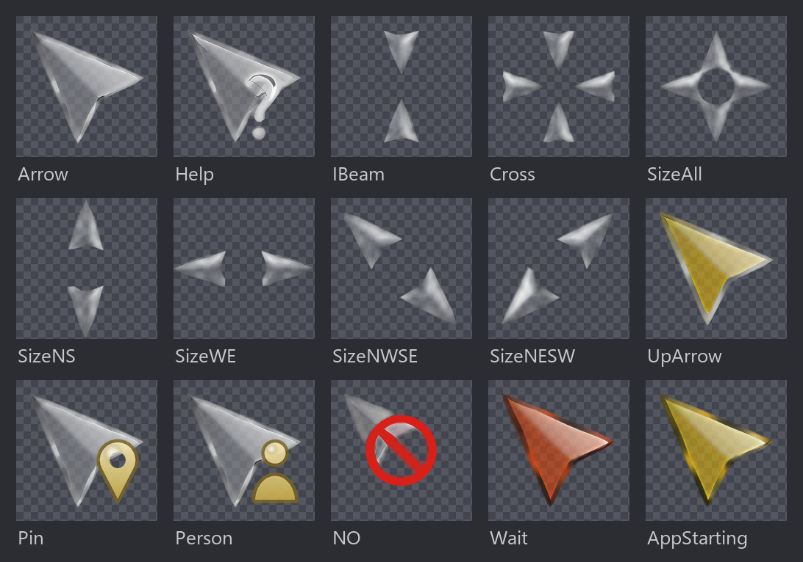

<div align="center">

# Chrome Glass Remastered

**The 2006 Chrome Glass cursors, redrawn for today's screens.**

[](README.ru.md)
[](https://github.com/mikedigriz/Chrome-Glass-Remastered-cursors/releases/latest)
[](LICENSE)

[](https://github.com/mikedigriz/Chrome-Glass-Remastered-cursors/releases/latest)

**Windows 10/11 · Linux · macOS 15+**



</div>

On 23 April 2006 yoyos posted [Chrome Glass](https://www.deviantart.com/yoyos/art/Chrome-Glass-32252748) on DeviantArt: glass pointers for CRTs and the first LCDs, 32 px, Windows XP at 1280x1024. Twenty years on, the desktop still stretches those same 32 px across a pointer four times the size, and the glass turns to mush.

This is the same set, redrawn up to 512 px. Shape, colour and timing stay the author's: the 32 px images inside the shipped cursors are his original frames, byte for byte. What changed is everything above 32 px, which is all you actually see now.

Checked on Windows 11 and Debian 13 (GNOME on X11). The macOS cape is built and validated by the build, but nobody has applied it on a real Mac yet.

## Installation

All files live in the [latest release](https://github.com/mikedigriz/Chrome-Glass-Remastered-cursors/releases/latest).

| Your system | File | How it goes on |
|---|---|---|
| Windows 10/11 | `ChromeGlassRemastered-windows.zip` | right-click `Install.inf`, choose **Install** |
| Linux | `.deb`, or `ChromeGlassRemastered-linux.tar.gz` | install the package, or unpack into `~/.local/share/icons` |
| macOS 15+ | `ChromeGlassRemastered.cape` | open it with [Mousecape](https://github.com/sdmj76/Mousecape-swiftUI) |

<details open>
<summary><b>🪟 &nbsp;Windows 10 / 11</b></summary>

1. Unpack `ChromeGlassRemastered-windows.zip`.
2. Right-click `Install.inf` and choose **Install**. On Windows 11, open **Show more options** first if the command is hidden.
3. Go to **Settings → Bluetooth & devices → Mouse → Additional mouse settings → Pointers**, pick **Chrome Glass Remastered** under *Scheme*, click **Apply**.
4. Worth doing: **Settings → Accessibility → Mouse pointer and touch**, and drag the pointer size up. Above the minimum size is where the redrawn artwork shows.

To remove it: same **Pointers** tab, select the scheme, click **Delete**, then switch back to **Windows Default**. The files stay in `%WINDIR%` until you delete them - see [full removal](docs/DETAILS.md#windows).

</details>

<details>
<summary><b>🐧 &nbsp;Linux</b></summary>

| Distro | Install |
|---|---|
| Debian / Ubuntu / Mint | `sudo apt install ./chrome-glass-remastered-cursors_*_all.deb` |
| Arch / Manjaro | download the release `PKGBUILD`, run `makepkg -si` in its directory |
| Any, no root | `mkdir -p ~/.local/share/icons && tar -xzf ChromeGlassRemastered-linux.tar.gz -C ~/.local/share/icons/` |

Then pick **Chrome Glass Remastered** in GNOME Tweaks, or **System Settings → Appearance → Cursors** on KDE Plasma. From a terminal:

```sh
gsettings set org.gnome.desktop.interface cursor-theme "Chrome Glass Remastered"  # GNOME
plasma-apply-cursortheme "Chrome Glass Remastered"                                # KDE Plasma
```

To remove it: `sudo apt remove chrome-glass-remastered-cursors`, `sudo pacman -R chrome-glass-remastered-cursors`, or `rm -rf ~/.local/share/icons/"Chrome Glass Remastered"` for the manual install.

</details>

<details>
<summary><b>🍎 &nbsp;macOS 15+</b></summary>

1. Install [Mousecape SwiftUI](https://github.com/sdmj76/Mousecape-swiftUI/releases) - the regular build, not Debug. It needs macOS Sequoia 15 or later and runs on Intel and Apple Silicon.
2. Download `ChromeGlassRemastered.cape` from the latest release.
3. Double-click the cape, or import it in Mousecape, then select it and apply.

Twelve system cursors get replaced: Arrow, IBeam, Move, Wait, Crosshair, Pointing Hand, Forbidden, Help and the four resize directions. The rest stay stock.

To put the system cursors back: **File → Reset System Cursor**, or <kbd>⌘</kbd>+<kbd>R</kbd>.

</details>

## Before / After

Left, the 2006 file the way your desktop enlarges it today. Right, the same two pointers drawn at 512 px. Arrow on top, Wait below.


## Animation in motion

Five pointers are animated: **AppStarting**, **Hand** on a link, **Handwriting**, **NO** and **Wait**.


## Not working?

- **The theme is missing from the list, or the old pointer is still there.** Log out and back in. Applications cache the cursor at startup, so restart the ones that still look wrong.
- **The animations look slower than on Windows.** They are, on purpose: Linux ships the author's own ~20 fps cadence, because 60 fps flickers on X11.
- **macOS changed the pointer only in some places.** Some applications draw their own cursors, and Mousecape cannot safely replace those.

Everything else, plus full removal per platform: **[docs/DETAILS.md](docs/DETAILS.md)**.

## The original

Chrome Glass is [yoyos' work](https://www.deviantart.com/yoyos/art/Chrome-Glass-32252748). This is an unofficial remaster, published as a tribute, keeping the attribution with the artwork.

The cursor artwork is **not** covered by the MIT license - see [`NOTICE`](NOTICE). The build and packaging code is MIT, see [`LICENSE`](LICENSE).

## More

- **[docs/DETAILS.md](docs/DETAILS.md)** - what is inside each package, what each platform can and cannot do, full removal, checksums, the longer troubleshooting list.
- **[docs/BUILD.md](docs/BUILD.md)** - build it yourself. Python, Pillow, NumPy, no GPU.
