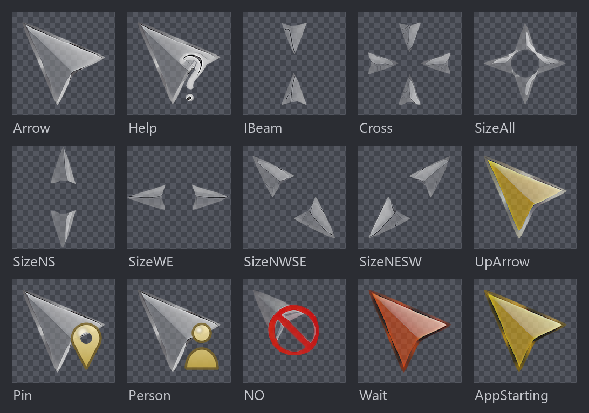
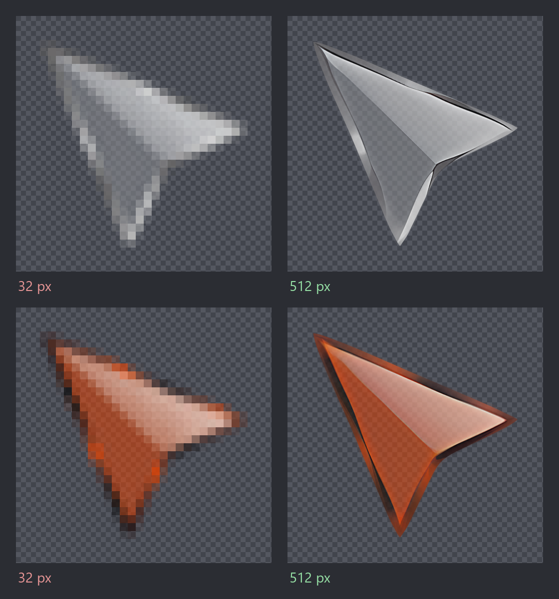
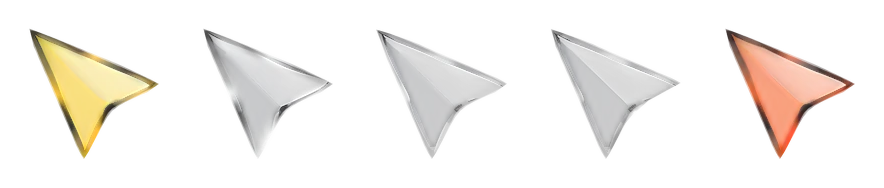

<div align="center">

# Chrome Glass Remastered

**Помните стеклянные курсоры из 2006-го? Они вернулись - и больше не превращаются в кашу на 4K.**

[](README.md)
[](../../releases/latest)
[](LICENSE)

[](../../releases/latest)

Windows · Linux · macOS · 17 курсоров · бесплатно



</div>

В 2006 году на DeviantArt вышел набор курсоров «Chrome Glass» - стеклянный, живой, но нарисованный под 32 px, поэтому на 4K превращается в кашу. Я пересобрал его для больших экранов, сохранив шарм.

## В чём разница

Те же два курсора так, как их показывает экран 4K: слева оригинал 2006 года, 32 px, растянутый системой. Справа ремастер, нарисованный нативно в 512.



| | Chrome Glass (2006) | Chrome Glass Remastered |
|---|---|---|
| Разрешение | 32 px | **256 px** на Windows, **512 px** на Linux [^1] |
| Края | битмап, мыло при увеличении | вектор, резкие на любом размере |
| Анимация | 9 кадров, ~20 fps | **27 кадров, 60 fps** [^2] |
| Курсоры | 15 слотов | **17** - добавлены Pin и Person из Windows 10/11, которых в 2006 году не существовало |
| Платформы | Windows | Windows, Linux, macOS |

[^1]: У анимированных потолок ниже: 96 px на Windows, 384 px на Linux. Windows отказывается принимать анимированные кадры крупнее, а кадр анимации в 512 px весит около мегабайта.
[^2]: На Windows и macOS - у ожидания, запуска и руки-указателя. На Linux эти три идут на ~20 fps, как в оригинале, именно поэтому они не мигают. Handwriting и NO везде сохраняют авторский тайминг.

## Установка

Всё лежит в [последнем релизе](../../releases/latest). Выберите свою систему:

<details open>
<summary><b>🪟 &nbsp;Windows 10 / 11</b></summary>

1. Скачайте и распакуйте `ChromeGlassRemastered-windows.zip`.
2. ПКМ по `Install.inf` -> **Установить**.
3. Параметры -> Мышь -> *Дополнительные параметры мыши* -> **Указатели** -> схема **Chrome Glass Remastered** -> Применить.
4. **Увеличьте размер указателя.** Параметры -> Специальные возможности -> Указатель мыши. По умолчанию Windows стоит на самом мелком из 15 размеров - ровно на том, где этот набор ничем не отличается от любого другого. Всё, что крупнее, и есть то, ради чего он пересобран.

**Удаление:** ПКМ по тому же `Install.inf` -> **Удалить**. Схема снимется, скопированные курсоры удалятся.

</details>

<details>
<summary><b>🐧 &nbsp;Linux (Xcursor)</b></summary>

| Дистрибутив | Установка | Удаление |
|---|---|---|
| Debian / Ubuntu / Mint | `sudo dpkg -i chrome-glass-remastered-cursors_*_all.deb` | `sudo dpkg -r chrome-glass-remastered-cursors` |
| Arch / Manjaro | `cd packaging && makepkg -si` | `sudo pacman -R chrome-glass-remastered-cursors` |
| Без root | `mkdir -p ~/.icons/ && tar -xzf ChromeGlassRemastered-linux.tar.gz -C ~/.icons/` | `rm -rf ~/.icons/"Chrome Glass Remastered"` |

`.deb` дополнительно регистрирует тему через `update-alternatives`, поэтому она может стать системной; удаление пакета откатывает это начисто. У [PKGBUILD](packaging/PKGBUILD) из релиза уже заполнена контрольная сумма.

Дальше включите тему:

```sh
gsettings set org.gnome.desktop.interface cursor-theme "Chrome Glass Remastered"  # GNOME
plasma-apply-cursortheme "Chrome Glass Remastered"                                # KDE
```

Или выберите её в GNOME Tweaks / параметрах KDE. На голом X11/Wayland пропишите `XCURSOR_THEME="Chrome Glass Remastered"`.

**Курсор не меняется?** Некоторые архиваторы при «Извлечь в папку...» создают лишнюю папку-обёртку. Проверьте, что тема лежит прямо в `~/.icons/Chrome Glass Remastered/`, а не на уровень глубже. После смены темы GNOME на X11 нужно перезапустить Shell (`killall -3 gnome-shell`), на Wayland и в KDE - перелогиниться.

**Курсор мигает?** Раньше анимация шла на 60 fps и периодически не попадала в такт с 60-герцовым экраном. Теперь ожидание, запуск и рука-указатель на Linux идут на ~20 fps, как в оригинале, мигать нечему. Если мигает после обновления темы - перезапустите приложение: курсоры кэшируются при старте.

</details>

<details>
<summary><b>🍎 &nbsp;macOS (Mousecape)</b></summary>

Темы курсоров на macOS ставит бесплатный [Mousecape](https://github.com/alexzielenski/Mousecape):

1. `brew install --cask mousecape`
2. Скачайте `ChromeGlassRemastered.cape`, откройте двойным кликом.
3. ПКМ по cape -> **Apply**.

Cape меняет двенадцать курсоров: стрелку, текст, руку-указатель, крест, перемещение, ожидание, запрет, справку и четыре стрелки resize. Остальные - системные.

**Удаление:** ПКМ по cape в Mousecape -> **Restore**, затем удалите его из библиотеки.

**Важно:** с каждой версией macOS Apple всё сильнее закручивает гайки на тему курсоров. Mousecape требует частично отключённого SIP и может не работать на Apple Silicon вовсе. Если `Apply` ничего не даёт - это ограничение Mousecape/macOS, не баг набора. Загляните в [issues Mousecape](https://github.com/alexzielenski/Mousecape/issues), прежде чем писать сюда.

</details>

В каждом релизе есть `SHA256SUMS`, если хотите проверить скачанное до запуска установщика: `sha256sum -c SHA256SUMS`.

## В движении

Пять курсоров анимированы. Слева направо: **AppStarting**, **Hand** (наведение на ссылку), **Handwriting**, **NO**, **Wait**.



## Как это устроено

Курсор - это три слоя: **оригинал 32 px** для подлинности, **AI-апскейл до 512 px** для цвета и переливов (посчитан один раз и лежит в репозитории - ужать чище, чем растянуть) и **векторный контур** для чётких краёв на любом масштабе. Апскейлер настроен под иллюстрации, поэтому даже бледные курсоры (Help, IBeam, Cross, стрелки resize) получают ровный цвет без шума, а отдельный проход резкости подчёркивает края.

Прозрачность увеличивают отдельно от цвета: растянутая прямо с 32 px, она теряет стеклянный блеск. Цвета в альфа-канале нет и портить нечего, поэтому увеличенную версию используют все курсоры, включая бледные.

## Собрать самому

Все AI-мастера уже в репозитории, поэтому для обычной сборки не нужны ни GPU, ни torch:

```sh
pip install -r requirements.txt
python3 build.py
```

Скрипт пересобирает `dist/`, `packages/` и превью, а в конце сверяет результат с оригиналом и ругается, если что-то поехало. Подробности - структура репозитория, порядок сборки, пересчёт AI-апскейлов - в **[docs/BUILD.ru.md](docs/BUILD.ru.md)**.

## Лицензия

Оригинальная графика: [«Chrome Glass» от yoyos, DeviantArt, 2006](https://www.deviantart.com/yoyos/art/Chrome-Glass-32252748) (см. [`NOTICE`](NOTICE)). Код - **MIT** ([`LICENSE`](LICENSE)).

Chrome Glass годами остаётся моим любимым набором курсоров - спасибо, yoyos.

Что-то не работает? Откройте issue и укажите ОС, версию релиза и размер указателя - эти три пункта закрывают большую часть вопросов.

---

<div align="center">

*Накрыло ностальгией? Поставьте звезду - так курсоры найдут остальных, кто скучает по 2006-му.* ⭐

</div>
